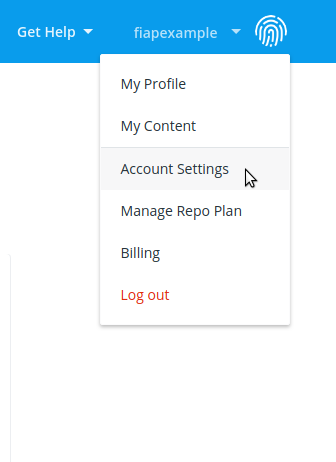
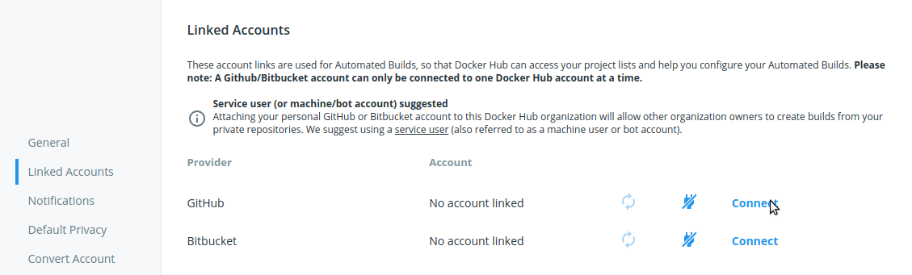
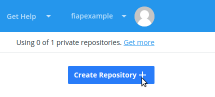
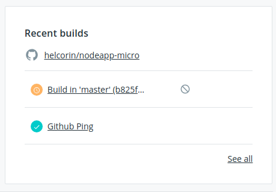
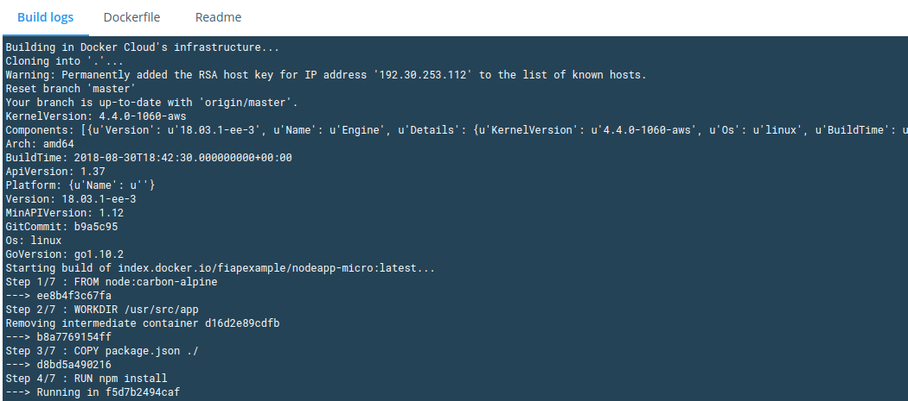
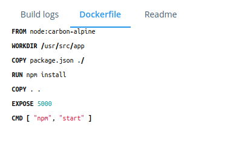
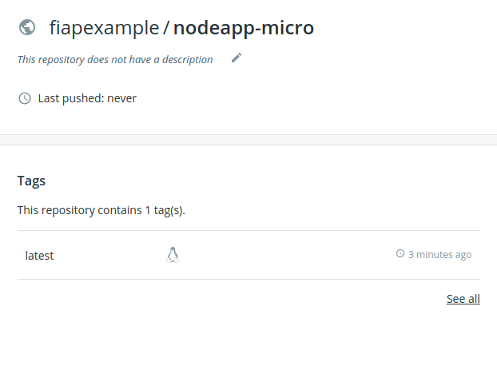

# Laboratório Prático

**Objetivo:** Testat o processo de integração entre uma aplicação contruída com base em containers e um repositório Git.

**Pré-Requisitos:** 

- Possuir uma conta ativa no [Github](https://github.com/);
- Possuir uma conta ativa no [Docker Hub](https://hub.docker.com/);

# Copiando o repositório base

Para execução deste lab acesse o Github e faça um **Fork** do repositório [https://github.com/fiapsecdevops/nodeapp-micro](https://github.com/fiapsecdevops/nodeapp-micro);


# 1. Criando a integração entre o Docker Hub e o Github:

Com o fork executado você possui uma cópia do repositório original, em seguida acesse o [Docker Hub](https://hub.docker.com/), será necessário vincular essa conta a sua conta no github;

1. No painel principal acesse a opção **Account Settings** no menu localizado no canto superior direito:

2. No menu seguinte escolha a seção **Linked Accounts**;

3. Selecione a opção **connect** para conectar o repositório a sua conta no Github;
4. Utilize a opção **Authorize docker** para conceder acesso ao Github (Neste momento a senha do github será solicitada);


# 2. Criando o novo Repositório:

Para montar a interação basta criar um repositório responsável pelas imagens que serão geradas, e estabelecer um link entre este repositório e o Github:

1. Volte a painél inicial do Docker Hub e escolha a opção **Repositories**;
2. Em seguida escolha a opção **Create Repository**:

3. Preencha as opções referentes a criação com o **nome: "nodeapp-micro"** e a opção **visibility como "Public**;
4. No final da página localize a opção "Build Settings" nela será configurado o gatilho de integração:
5. Clique sobre a opção "Connected" referente a conexão criada anteriormente e selecione a sua conta e o repositório "nodeapp-micro" (fizemos o fork dele momentos atrás);
6. Verifique que é possível criar regras especificas de integração, como por exemplo:
    - Vincular o processo de build a uma branch específica;
    - Vincular o processo de build a tags geradas no github;
    - Definir qual será a tag gerada no Docker após o build;
    - Alterar o nome do arquivo usado no Build (por padrão trata-se do arquivo "Dockerfile" gerado na raiz do repositório Git);
7. Para este lab finalize a configuração clicando em "Create & Build" sem alterar nenhum parâmetro:


# Processo de Build:

A sequencia anterior criou a integração necessária para que o Docker Hub verifique o repositório da aplicação e faça o build de uma nova imagem com base nos critérios estabelecidos na configuração;

1. Após finalizar o processo você verá um build pendente em seu repositório Docker:

2. Depois de alguns minutos este build será iniciado automaticamente;
3. Após iniciado é possível acompanhar o processo clicando sobre o Build listado na imagem anterior:

4. O Dockerfile usado no processo de Build é obtido a partir do repositório inicial:

5. Ao final do processo você verá uma imagem gerada automaticamente com base no código fonte do Github e nas instruções de build:


6. É possível executar um teste com o pull desta imagem usando um sistema operacional com docker instalado:

```sh
docker pull <seu-repositorio-no-docker>/nodeapp-micro:latest
```


