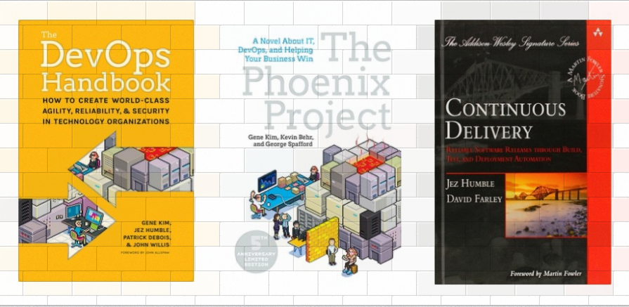

!SLIDE inverse center transition=fade

<h1 style="color:white;">SECURITY DEVOPS</h1>

!SLIDE center transition=fade
#Curso: Sistemas para Internet
##Disciplina: DevOps

!SLIDE incremental transition=fade

# Estrutura da Disciplina

- Cultura DevOps
- Agile Team Organisation (Squads, Chapters, Tribes, Guilds)
- Boas Práticas de Desenvolvimento (12 Factory)
- Integração Contínua (continuous integration)
- Continuos Integration na Prática e modelos complexos de integração de código
- Monitoração de Aplicações
- Conceitos sobre Qualidade Contínua de Código
- Conceitos sobre  Infraestrutura como Código

# Conteúdos sobre Desenvolvimento Seguro:

- Desenvolvimento seguro (Base sobre SQLi, XSS e CSRF)
- Criptografia de Conexões (Rest e HTTP(s))

!SLIDE transition=fade

#  Sobre o Professor

## Helder Pereira

Engenheiro de Sistemas SRE na UOL e Professor na FIAP foco em 
arquiteturas baseadas em microserviços e  na filosofia 
DevOps, apaixonado pelo universo Open Source.

Pós Graduado MBA em Arquitetura e Gestão de Técnologia, 7 anos de atuação como Engenheiro de Sistemas, atualmente envolvido em projetos de SRE na UOL;

Contato:

- Email: <a href="mailto:profhelder.pereira@fiap.com.br">profhelder.pereira@fiap.com.br</a> 
- Linkedin: <a href="https://www.linkedin.com/in/hpinfo">https://www.linkedin.com/in/hpinf</a>

!SLIDE transition=fade

# Bibliográfia

!SLIDE transition=fade

# Bibliográfia

#### The DevOps Handbook
- **Autor(es):** Gene Kim,‎ Jez Humble, Patrick Deboi, John Willis
- **Editora:** IT Revolution Press;
- **Sinopse:** *Neste livro teremos uma forte referência sobre a cultura DevOps, e bases para sua implementação, boa parte do conteúdo conceitual das primeiras aulas foi baseado nele;*

#### The Phoenix Project
- **Autor(es):** Gene Kim,‎ Kevin Behr e‎ George Spafford
- **Editora:** IT Revolution Press;
- **Sinopse:** *O livro trás a história de uma empresa com todos os esteriótipos e chamados anti-patterns possível e seu processo de evolução para uma cultura ágil;*

#### Continuous Delivery: Reliable Software Releases through Build, Test, and Deployment Automation
- **Autor(es):** Jez Humble e David Farley;
- **Editora:** Bookman;
- **Sinopse:** *Da mesma forma que o livro anterior trata-se de uma obra técnica que descreve todo o processo de pipeline e as práticas de delivery, deploy e integração contínua, base para nossos laboratórios;*
