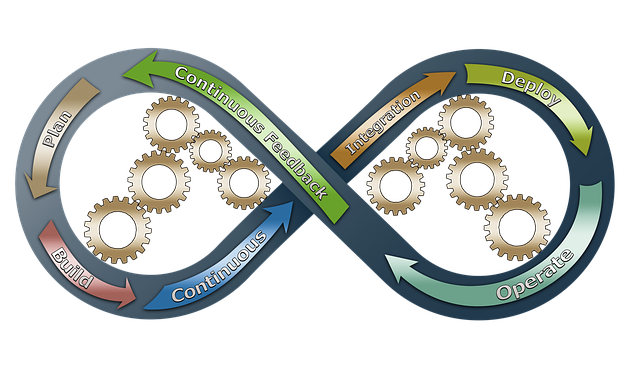

!SLIDE inverse center transition=fade

<h2 style="color:white;">Cultura DevOps</h2>

!SLIDE incremental transition=scrollUp

# O termo devops: 

- O termo devops foi cunhado por volta de 2009, na O’Reilly Velocity Conference por **John Allspaw** e **Paul Hammond**;

- Motivação: Tentativa de resolver o conhecido problema do ‘finger pointing’ entre desenvolvimento e produção;

- No mesmo ano **Patrick Debois** cria a conferencia “agile system administration” precursora do atual ["DevOps Day"](https://www.devopsdays.org/);

!SLIDE incremental transition=fade

# Fundamentos por trás da Cultura DevOps

**Manifesto Ágil:**

- Indivíduos e interações são mais importantes que processos e ferramentas;
- Software funcionando é mais importante do que documentação completa e detalhada;
- Colaboração com o cliente é mais importante do que negociação de contratos;
- Adaptação a mudanças é mais importante do que seguir o plano inicial;

Referência: [https://agilemanifesto.org/iso/en/manifesto.html](https://agilemanifesto.org/iso/en/manifesto.html)

!SLIDE incremental transition=fade

# Caracteristicas

## Devisão em 4 Eixos: (Extra Oficial)

- Cultura;
- Automação;
- Avaliação;
- Compartilhamento;

Baseado em um artigo escrito por John Willis em meados de 2010: [What Devops Means to Me
](https://blog.chef.io/2010/07/16/what-devops-means-to-me/)

.callout.question `Essa definição é universal?`

`Não existe uma classificação única ou conjunto de definições "oficial" para DevOps, trata-se de uma cultura e não de uma metodologia ou framework`

!SLIDE incremental transition=fade"

# CAMS

Os 4 eixos definidos por Willis geraram um acrônimo que passou a ser usado para descrever o que seria o coração dos valores por trás do movimento DevOps o termo é abordado em detalhes nessa wiki de referência sobre o assunto:

CAMS em detalhes: [http://devopsdictionary.com/wiki/CAMS](http://devopsdictionary.com/wiki/CAMS)

!SLIDE incremental transition=fade

# Ciclo DevOps

Se você pesquisar pelo termo DevOps no Google é muito provável que encontre imagens como esta:

!SLIDE incremental transition=fade

# Ciclo DevOps

É muito comum que esta imagem seja utilizada pois ela representa todas as etapas desde a concepção de uma idéia até seu desenvolvimento, entrega em produção e telemetria ou Feedback como mecanismo para retroalimentação e gatilho para melhoria contínua.

Jez Humble descreve em seu Livro Delivery Contínuo um conceito que representa essa imagem e provavelmente a fundamentação que levou a busca por modelos diferentes de deploy e controle de aplicações, a busca por DevOps:

> "...The most important problem that we face as software professionals is this: If somebody thinks of a good idea, how do we deliver it to users as quickly as possible?..."