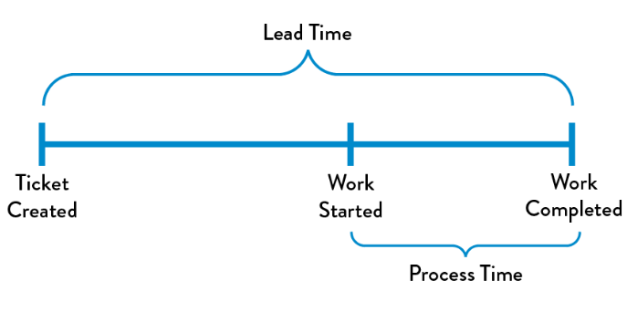
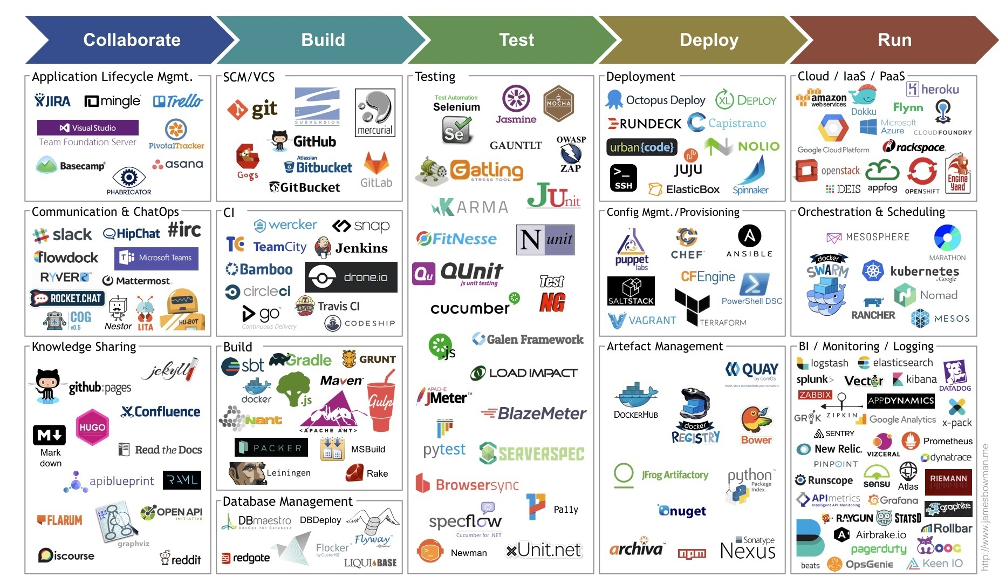

!SLIDE incremental transition=fade

# DevOps X LeanIT

O FLuxo de Valor é um dos 5 fundamentos da filosofia Lean;

Só pra relembrar:

**Fluxo de Valor:** Princípio Lean que representa todas as etapas necessárias para viabilizar um produto ou serviço, desde a concepção até a entrega ao cliente, incluindo todos os fluxos de
informação, trabalho e materiais.

.callout.question `A filosofia Lean trata da possibilidade de reduzir as atividades que geram desperdícios e aumentar as atividades que agregam valor.`

!SLIDE incremental transition=fade

# DevOps X LeanIT

Uma passagem interessante no começo do Livro "The DevOps Handbook" observa que para melhorar o fluxo de valor geralmente há um foco em questões como:

- Criação de um fluxo tão simples quanto possível e uniforme;
- Uso de técnicas como *"small batchs"*;
- Redução do paralelismo de trabalhos em andamento (WIP);
- Eliminação de retrabalho
- Otimização constantemente de sistemas (melhoria continua);

!SLIDE incremental transition=fade

# DevOps X LeanIT

Todos os princípios citados e abordados em LeanIT na melhoria do fluxo de valor são igualmente aplicáveis a melhoria de técnologias e ferramentas de suporte a implementação e operação usando metodologias ágeis.

**DevOps não só está diretamente relacionado a Lean como é em alguns aspectos uma extrapolação deste modelo sendo aplicado não só a etapa de desenvolvimento mas a operação de aplicações.**

> "...Because value is created only when our services are running in production, we must ensure that we are not only delivering fast flow, but that our deployments can also be performed without causing chaos and disruptions such as service outages, service impairments, or security or compliance failures..." 

> The DevOps Handbook;

!SLIDE incremental transition=fade

# DevOps X LeanIT

**Lead Time vs. Processing Time**

Outro ponto fundamental da filosofia Lean que explica a concepção de DevOps é a relação entre Lead Time e Process Time;

A medição do lead time inicia quando a solicitação é feita e termina quando é atendida, já para o Processing Time temos como início o momento em que começamos a trabalhar na solicitação do cliente até o seu término.

!SLIDE incremental transition=fade

# DevOps X LeanIT

**Lead Time vs. Processing Time**

**Uma das principais funções atribuidas a implementação de uma cultura DevOps é melhorar os processos usados na entrega de código o que envolve não só o termino da atividade mas o deploy em produção** 

Tal melhoria proporciona reduções no Leadtime e principalmente no Process Time pois só ao final de ambos os ciclos temos Valor (do ponto de vista di cliente);

.callout.question `OK e como eu chego lá?`

`Tem muita coisa envolivda mas podemos começar pensando na eliminação de silos, melhoria de comunicação e abordagem de infraestrutura e ecossistemas de desenvolvimento utilizando os conceitos descritos no CAMS`

`Em um momento futuro deste curso abordaremos especificamente as estratégias de implementação.`

!SLIDE incremental transition=fade

# People over Process over Tools

No artigo "What DevOps Really Means" publicado por [Adam Mackay]  (https://medium.com/@AdamTemper) um trecho em específico chama atenção para este ponto: **Pessoas a frente de processos e a frente de ferramentas**;

Trata-se de uma estratégia de implementação baseada na seguinte lógica:

1. Identificar o resposável por um processo;
2. Definir o processo envolvido e todas as suas características;
3. Selecionar e implementar a cadeia de ferramentas para executar esse processo;

.callout `A ideia base é evitar aquisição de ferramentas e recursos desnecessários, isso é extremamente relevante se considerarmos a relação de soluções baseadas em DevOps como no chart a seguir...`

!SLIDE transition=fade

# Ecossistema DevOps

**Falando em ferramentas as opções são consideráveis:**

