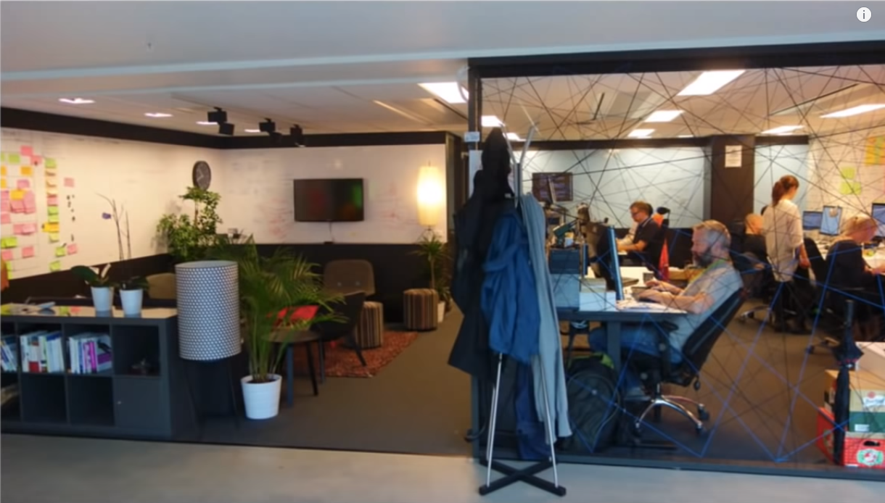
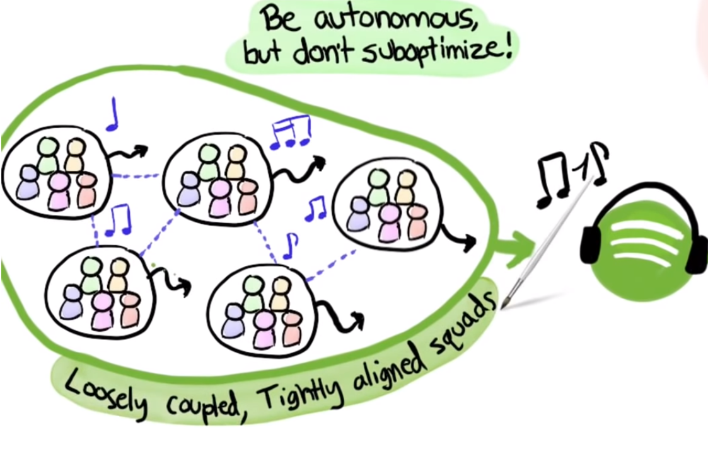
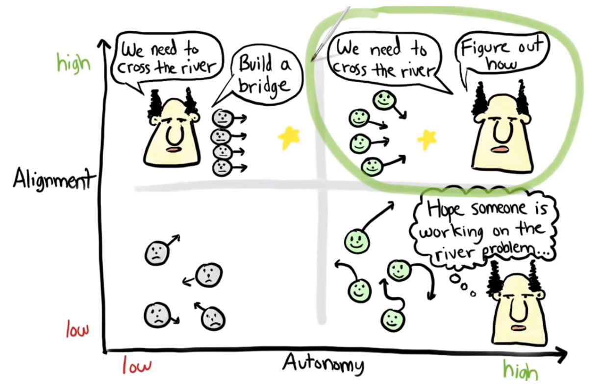
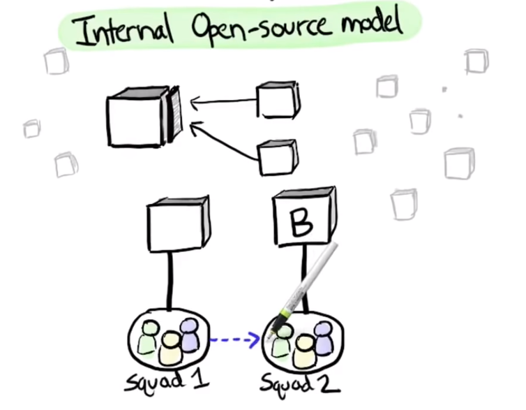
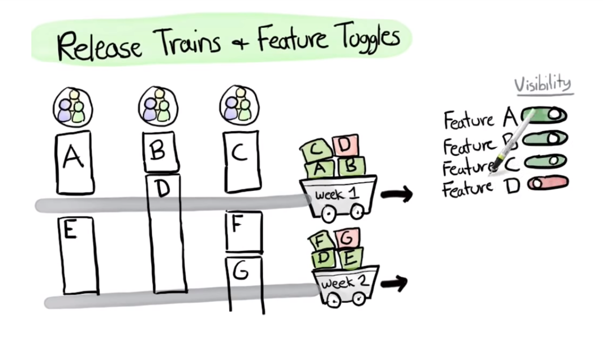
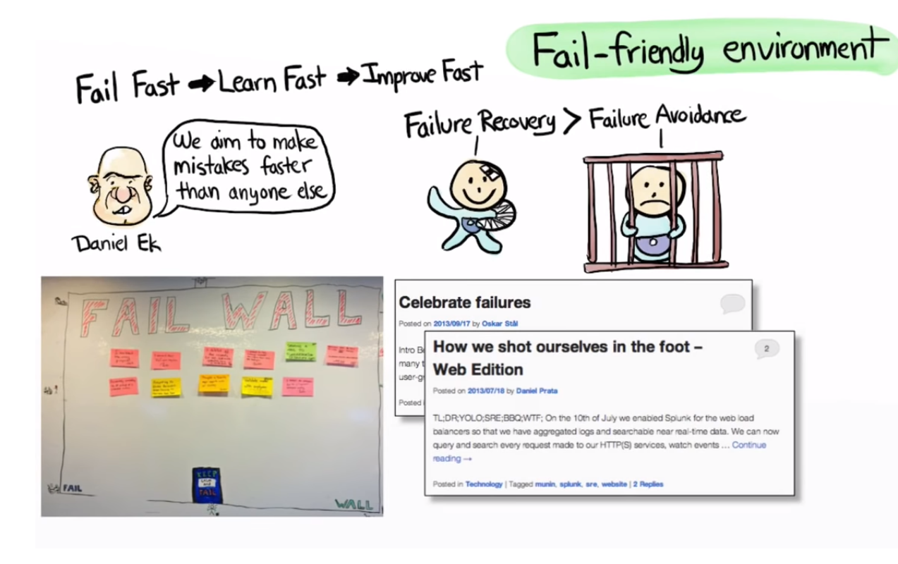
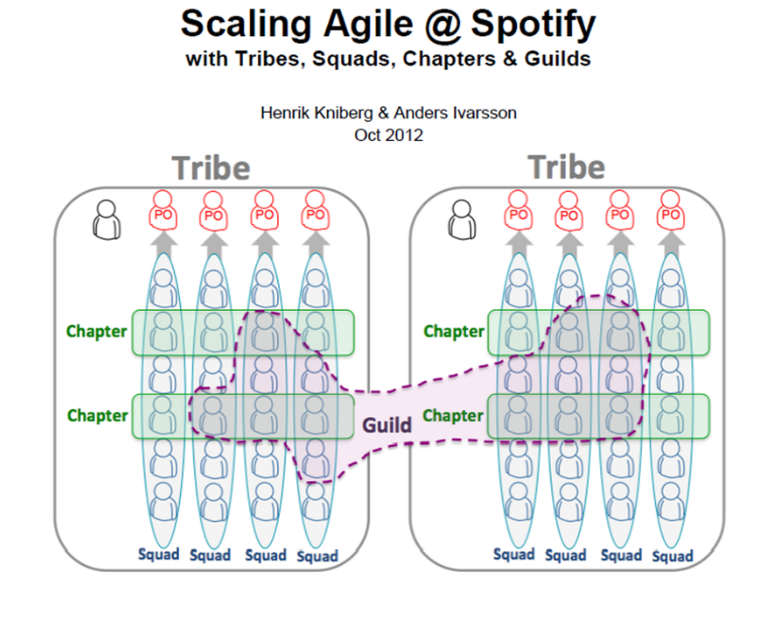
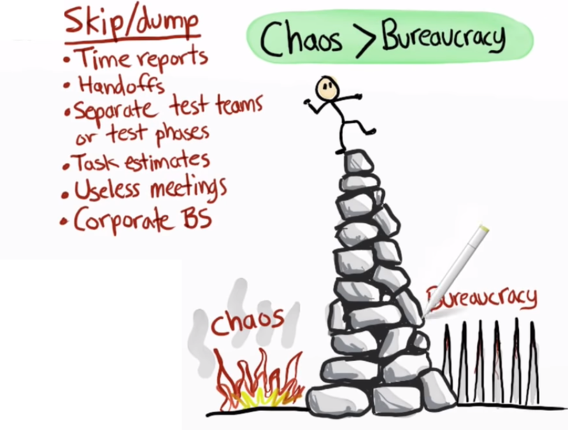
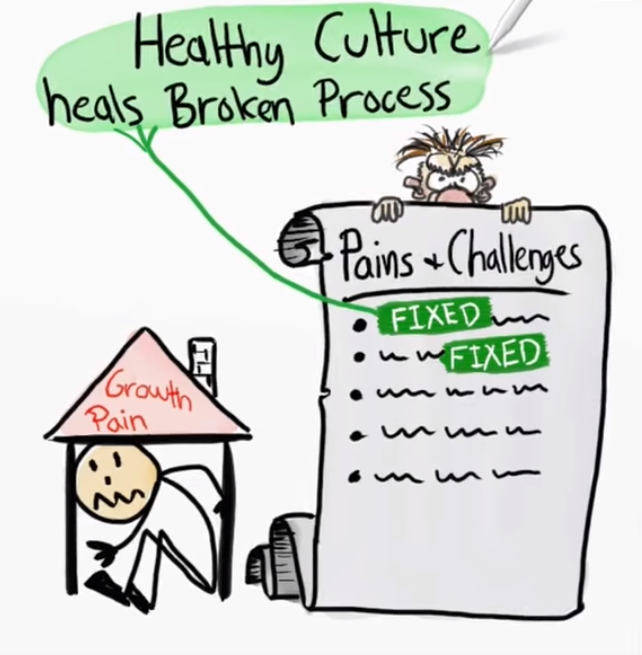

!SLIDE inverse center transition=fade

<h2 style="color:white;">Agile Team Organisations</h2>

!SLIDE incremental transition=fade

# Spotfy (Modelo baseado em Squads)

Case de implementação do Spotfy

**Be Autonomous, but don`t suboptimize!**

.callout.info `O Spotify se tornou amplamente conhecido como um modelo de empresa ágil, isso ocorreu devido a implementação utilizada baseada em arquiteturas DevOps e metodologias de trabalho e organização`

!SLIDE transition=fade

# Spotfy (Modelo baseado em Squads)

<iframe width="560" height="315" src="https://www.youtube.com/embed/R2o-Xm3UVjs" frameborder="0" allow="accelerometer; autoplay; encrypted-media; gyroscope; picture-in-picture" allowfullscreen></iframe>

Link do Vídeo: [https://www.youtube.com/embed/R2o-Xm3UVjs](https://www.youtube.com/embed/R2o-Xm3UVjs) 

!SLIDE transition=fade

# Spotfy (Modelo baseado em Squads)

Espaço de Trabalho

!SLIDE transition=fade

# Spotfy (Modelo baseado em Squads)

Desacoplação entre os "Squads"

!SLIDE incremental transition=fade 

# Spotfy (Modelo baseado em Squads)

* A base são os squads (um time de scrum com um P.O. ou product owner dedicado);
* Os squadas sentam juntos conforme a imagem anterior;
* Um squad e possue em sua composição todo o "skill" e ferramentas necessárias para o desenvolvimento do Projeto;
* Dai a filosofia **Be Autonomous, but don`t suboptimize!**

!SLIDE transition=fade

# Spotfy (Modelo baseado em Squads)

Modelo de liderança baseado em autonomia

!SLIDE transition=fade

# Spotfy (Modelo baseado em Squads)

A autonomia também se aplica entre os times: 

!SLIDE transition=fade

# Spotfy (Modelo baseado em Squads)

Modelo de entrega de sprints

!SLIDE transition=fade

# Spotfy (Modelo baseado em Squads)

Visibilidade (inclusive no caso de erros)

!SLIDE transition=fade

# Spotfy (Modelo baseado em Squads)

A comunicação entre os times também ocorre na forma de interação e projetos

!SLIDE incremental transition=fade 

# Spotfy (Modelo baseado em Squads)

**As tribos**

O modelo baseado em Squads é relativamente simples, o interessante é a comunicação entre as equipes:

* Squads que compõem uma mesma aŕea de negócio e portanto tem muito em comum em desenvolvimento, metas etc são agrupados como "tribos";
* As tribos em geral ocupam uma mesma área, ou seja, para facilitar a comunicação estão fisicamente pŕoximas;
* A função dessa relação é que os times constantemente dividam o que estão fazendo, mesmo de maneira informal;

.callout.question `Existem vários cases de implementação onde é uma solução comum a adoção de algum modelo que aproxime área de mesmo interesse a fim de evitar retrabalho e manter o alimhaneto dos times baseado na visão e missão da cia`

!SLIDE incremental transition=fade 

# Spotfy (Modelo baseado em Squads)

**Capítulos**

Os capítulos são outra maneira pela qual o Spotify promove a colaboração e a inovação da equipe

* Os capítulos são um grupo ou membros da equipe que trabalham em uma área especial;
* Por exemplo, front-ends de diferentes tribos ou engenheiros de dados;
* O objetivo é que essas equipes reunam-se para trocar idéias, obter ajuda sobre desafios e discutir novas tecnologias;
* Neste caso o agrupamento é baseado em área de conhecimento visando difundir informação;

!SLIDE incremental transition=fade 

# Spotfy (Modelo baseado em Squads)

**Guildas**

Uma guilda é uma comunidade de colaboradores com interesses compartilhados.

* Trata-se de uma divisão mais informal;
* Por exemplo grupos de pessoas dentro da organização que desejam compartilhar conhecimento, código de ferramentas e práticas;
* Mesmo não sendo parte de uma mesma tribo ou Capítulo;
* Essas guildas possuem diferentes naturezas como tecnologia, guildas de automação de testes ou guildas de treinamento ágil;

!SLIDE transition=fade

# Spotfy (Modelo baseado em Squads)

A ideia é que cada implementação como neste case encontre seu equilibrio

!SLIDE transition=fade

# Spotfy (Modelo baseado em Squads)
Processos não são eliminados sem motivo, mas são melhorados quando necessário.

!SLIDE transition=fadeo

# Agile Team Organisation

O modelo abordado pelo Spotify acabou sendo usado como uma referência de sucesso;

Embora a complexida da comunicação entre Squads, Tribos e Chapters seja a grande o conceito básico permanece **Remover silos e eliminar a distancia entre os times** dessa forma outras empresas seguiram pelo mesmo caminho em alguns casos utilizando variações dessa nomenclatura:

+ Crew
+ Party
+ Unit
+ Faction
+ Troop
+ Lineup

Um exemplo dessas variações é esse artigo sobre [Como funcionam os Squads no Nubank](https://medium.com/mulheres-de-produto/como-funcionam-os-squads-no-nubank-e1194a6f2a9e);