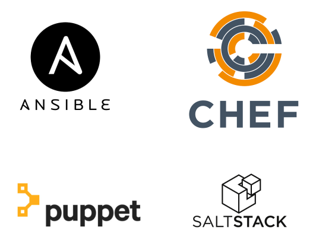
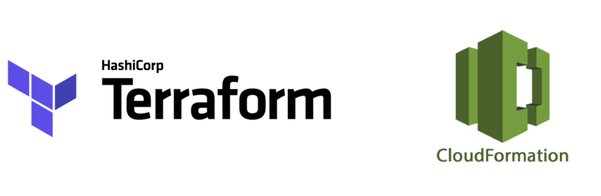
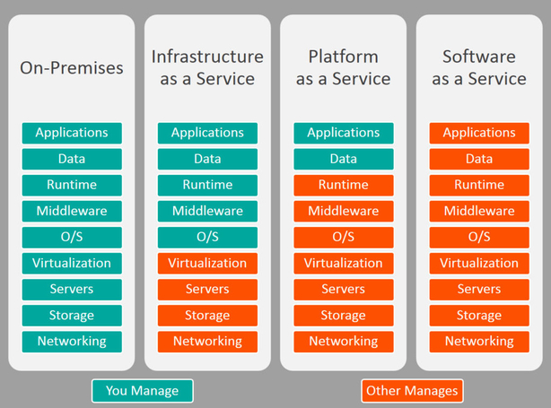

!SLIDE inverse center transition=fade

<h2 style="color:white;">Infraestrutura copmo Código</h2>

!SLIDE incremental transition=fade

# Gestão de Configuração e Boas Práticas Operacionais

**Infraestrutura como Código**

Chamamos de iac ou (infraestructure as a code) o processo de desenvolver e configurar a infraestrutura com base em código e ferramentas de automação de ambiente de forma que sua arquitetura possa ser versionada, testada e principalmente reproduzida sempre que necessário.

O uso dessa abordagem aumenta consideravelmente a velocidade do deploy de sistemas e a eficiência em processos de escalabilidade, esse formato é muito ligado à cultura de sistemas devops e na maioria dos casos possui como base duas características:

- **Computação em Núvem:** Seu uso gera arquiteturas mais escaláveis e maleáveis, o que possibilita criar e recriar servidores, balanceadores de carga etc...

- **Automação/Orquestração de Ambientes:** A segunda característica é a automação e orquestração usando ferramentas específicas para essa finalidade, a prmicia é fornecer ferramentas e meios para comunicação e manipulação de recursos, principalmente de cloud computing e virtualização.

!SLIDE incremental transition=fade

# Conceito

- Dentro da Cultura DevOps existem várias práticas e metodologias ou abordagens de trabalho que ajudam a conciliar agilidade e eficiencia sem causar o caos nos processo da Cia, essas abordagens são geralmente o que definem o sucesso ou fracasso da implementação;

- No caso de **iac** trata-se de uma abordagem para lidar com infra-estrutura que aproxima os times de operação das boas práticas de desenvolvimento através de recursos como automação, orquestração e versionamento de código;

- Esse perfil de infra-estrutura vem ganhando espaço e o profissional capaz de prover e administrar esse ambiente tende a se destacar no mercado, em muitos casos assumindo a alcunha de DevOps;`

.callout.warning `Tenha em mente que conceitualmente DevOps é um termo de referẽncia a cultura que estamos discutindo nessa matéria e não a um profissional único dentro da empresa.`

!SLIDE incremental transition=fade

# Ecossistema de soluções para iac

Hoje em dia existem muitas ferramentas de automação e configuração de ambientes criadas para essa finalidade, entre as mais famosos posso citar  projetos como [Ansible](https://www.ansible.com/), [Chef](https://www.chef.io/chef/), [Puppet](https://puppet.com/) e [SaltStack](https://saltstack.com/).

!SLIDE transition=fade

# Ecossistema de soluções para iac

No exemplo abaixo existe um trecho de código declarativo de infra estrutura com base na solução de automação puppet:

    @@@shell
    if $::osfamily == 'RedHat'     {

      # install httpd package
      package { 'httpd':
        ensure => installed,
      } 
      # ensure apache2 service is running
      service { 'httpd':
        ensure => running,
      }
    }

!SLIDE incremental transition=fade

# Ecossistema de soluções para iac

Nos 4 exemplos anteriores  estamos falando em soluções para gerenciar ambientes, criar e alterar aplicações recriar recursos, garantir estado e etc;

Existe uma outra relação de ferramentas chamadas de orquestradores, essas possuem como função criar e destruir ambietnes em larga escala como o [CloudFormation](https://aws.amazon.com/pt/cloudformation/) da Amazon ou a multi cloud solução da hasicorp o [Terraform](https://www.terraform.io/)

!SLIDE transition=fade

# Ecossistema de soluções para iac

Exemplo de código para orquestração de recursos de rede:

    @@@shell
    resource "aws_vpc" "fiap_vpc" {
      cidr_block       = "10.0.0.0/16"
      enable_dns_hostnames = true
      enable_dns_support = true

      tags = {
        Project = "pmi"
      }
    }

    resource "aws_subnet" "fiap_subnet" {
      cidr_block = "${cidrsubnet(aws_vpc.fiap_vpc.cidr_block, 3, 1)}"
      vpc_id = "${aws_vpc.fiap_vpc.id}"
      availability_zone = "us-east-1a"
      map_public_ip_on_launch = true

      tags = {
        Project = "secdevops"
      }
    }

!SLIDE incremental transition=fade

# Modelos de serviços em cloud

Quanto ao uso de recursos em cloud computing existem certas classificações baseadas na maneira como os serviços são entregues aos seus usuários:

> Imagem obtida a partir do conteúdo do blog https://www.bmc.com/blogs