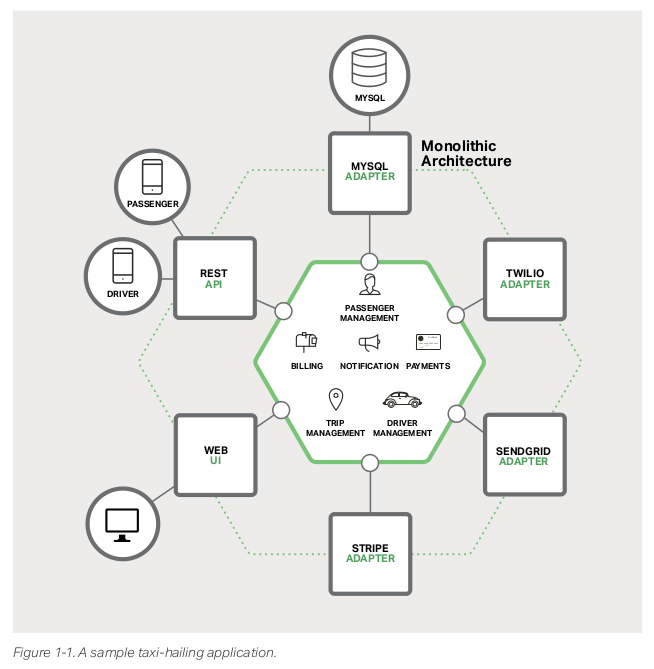
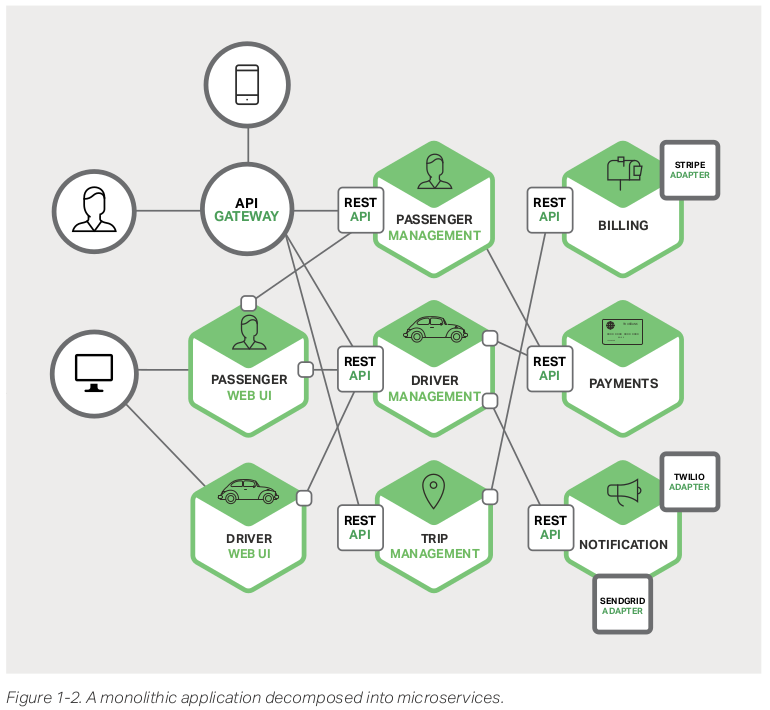

!SLIDE transition=fade

# Boas Práticas de Desenvolivmento de Software

**Arquiteturas baseadas em Microserviços**

Outro conceito muito aplicado no desenvolvimento de aplicações com arquiteturas modernas é o uso de micro serviços, trata-se de um modelo de arquitetura onde uma aplicação é construída como um conjunto de serviços modulares;

Cada módulo executa uma função específica e usa uma interface para se comunicar com outros módulos de serviços como REST ou HTTP(s);

!SLIDE incremental transition=fade

# Boas Práticas de Desenvolivmento de Software

**Arquiteturas baseadas em Microserviços**

Nos modelos tradicionais de desenvolvimento encontramos o que é definido como uma arquitetura monolitica, isto é uma unica aplicação principal ou core integrada a plataformas de apoio, banco de dados etc.

- No livro [Designing and Deploying Microservices](https://www.nginx.com/resources/library/designing-deploying-microservices/) dos autores Chris Richardson e Floyd Smith esse modelo é colocado em uma comparação interessante com micro serviços.

- A arquiteura descrita a seguir refere-se a uma plataforma de locomoção como Uber ou Cabify representada usando um modelo monolítico:

!SLIDE incremental transition=fade

!SLIDE incremental transition=fade

# Boas Práticas de Desenvolivmento de Software

**Exemplo de Arquitetura Monolítica**

No exemplo temos uma arquitetura onde um componente principal se comunica com uma API Rest, interface Web, um plugin de conexão com um banco de dados etc.

- Uma caracteristica comum dessas arquiteturas é que um compoente desempenhe mais de um papel o que dificulta processos de delivery e escalabilidade de aplicações;

- Outra característica é formato de empacotamento e deploy que depende da linguagem usada. Por exemplo, muitas aplicações Java são empacotados como arquivos WAR e implantadas em servidores de aplicação como o Tomcat ou o Jetty.

!SLIDE incremental transition=fade

# Boas Práticas de Desenvolivmento de Software

**Exemplo de Arquitetura Monolítica**

A abordagem utilizada em arquiteturas monolíticas tem uma enorme limitação

- Considere um projeto bem suced    ido, a tendência natural é que a infraestrutura/aplicação que o envolve começe a crescer ao longo do tempo;

- Eventualmente essa aplicação torna-se enorme. Durante cada sprint, sua equipe de desenvolvimento implementa mais algumas histórias;

- O que, obviamente, significa adicionar linhas de código e complexidade;

- Depois de alguns anos, sua pequena aplicação terá se tornado um monólito monstruoso;

!SLIDE incremental transition=fade

# Boas Práticas de Desenvolivmento de Software

**Arquiteturas baseadas em Microserviços**

Muitas organizações, como Amazon, eBay e Netflix, resolveram esse problema adotando o que hoje é conhecido como o padrão de Arquitetura baseada em Microserviços.

- Conforme comentado anteriormente neste modelo em vez de construir uma única aplicação de grande porte e monolítica, a idéia é dividir essa aplicação em um conjunto de serviços menores e interconectados.

- Ainda com base no exemplo de uma aplicação ficiticia visando concorrência de mercado com o Uber e Cabify teriamos o seguinte:

!SLIDE incremental transition=fade

!SLIDE incremental transition=fade

# Boas Práticas de Desenvolivmento de Software

**Vantagens e desvantagens no uso de Microserviços:**

- + A implementação é facilitada principalmente com o uso de containers;
- + Quando bem estruturada é uma plataforma facilmente escalável;
- + O modelo de encapsulamento facilita a compatibilidade e elimina questões de dependência;
- + Em geral é uma solução totalmente cloud-native;

Entretanto...

- - Potencialmente muito granulares;
- - Testes de integração e ambiente se tornam mais complexos;
- - Geralmente existe uma curva de aprendizado para sua implementação;