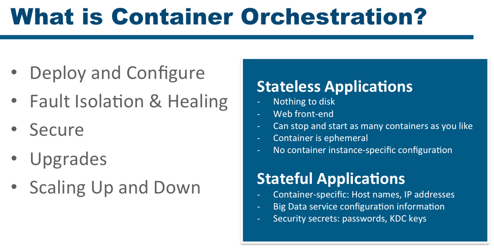
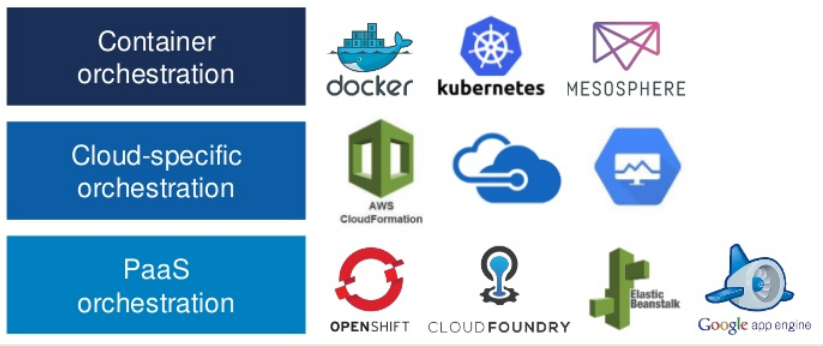

!SLIDE inverse center transition=fade

<h2 style="color:white;">Contaienrs X Microserviços</h2>

!SLIDE incremental transition=fade

# Boas Práticas de Desenvolivmento de Software

**A relação entre containers e microserviços**

Conforme a definição disponível no artigo ["O que é um container Linux?"](https://www.redhat.com/pt-br/topics/containers/whats-a-linux-container) publicado no blog da RedHat:

*Um container é um conjunto de um ou mais processos organizados isoladamente do sistema. Todos os arquivos necessários à execução de tais processos são fornecidos por uma imagem distinta, os containers são portáteis e consistentes durante toda a migração entre os ambientes de desenvolvimento, teste e produção.*

Trata-se de um arquitetura moderna baseada em sistemas operacionais linux e que se popularizou a partir de uma implementação criada pela Google chamada [Docker](https://www.redhat.com/pt-br/topics/containers/what-is-docker);

!SLIDE incremental transition=fade

# Boas Práticas de Desenvolivmento de Software

**A relação entre containers e microserviços**

Containers são agnósticos em relação a linguagens de programação e podem ser utilizados como solução para vários perfis de aplicações;

!SLIDE incremental transition=fade

# Boas Práticas de Desenvolivmento de Software

**A relação entre containers e microserviços**

O uso de Containers (em especial o Docker) surge como uma solução interessante para a construção de arquiteturas baseadas em microserviços;

- Isso se deve por uma série de fatores como:

    - Desacoplação;
    - Isolamento de recursos;
    - Escalabilidade horizontal; 

- O asusnto Docker está tão fortemente ligado a modelos baseados em micro serviços, pois ele se apresenta como a mais bem sucessida ferramenta para este tipo de arquitetura;

!SLIDE incremental transition=fade

# Boas Práticas de Desenvolivmento de Software

**A relação entre containers e microserviços**

Naturalmente existem ótimas soluções no mercado que permitem implementar plataformas baseadas em micro serviços usando soluções de encapsulamento em containers:

